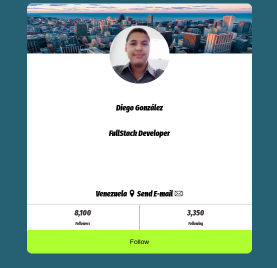

# frontend-developer-course
## Learning frontend basics
In this repository, I done all of the classes of the Frontend Developer course. I learned HTML and CSS basics, to make basics things with these tools.
Also, I made my first card :).

